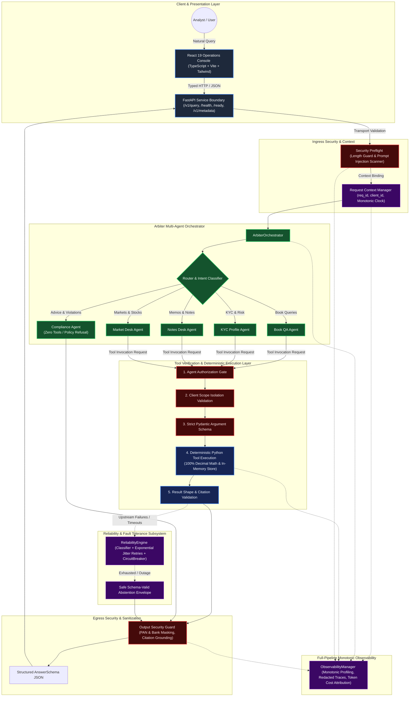
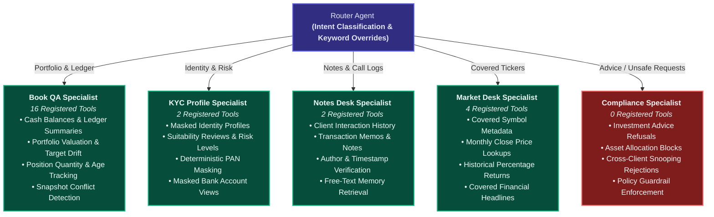
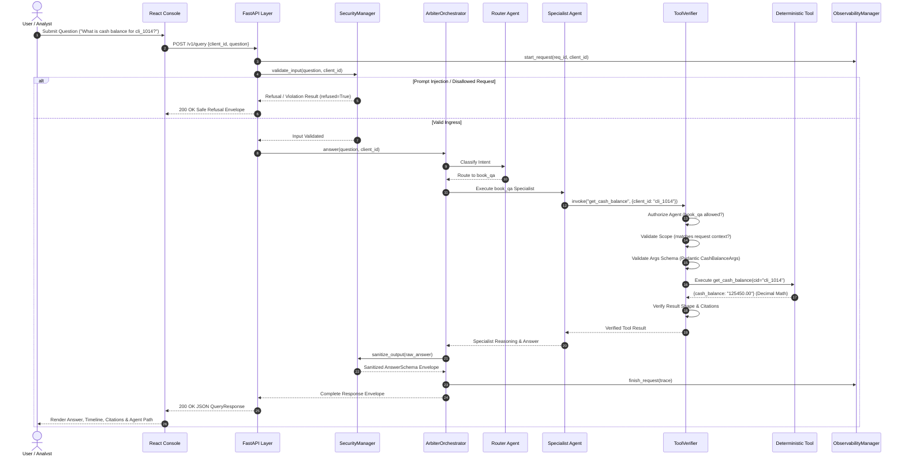
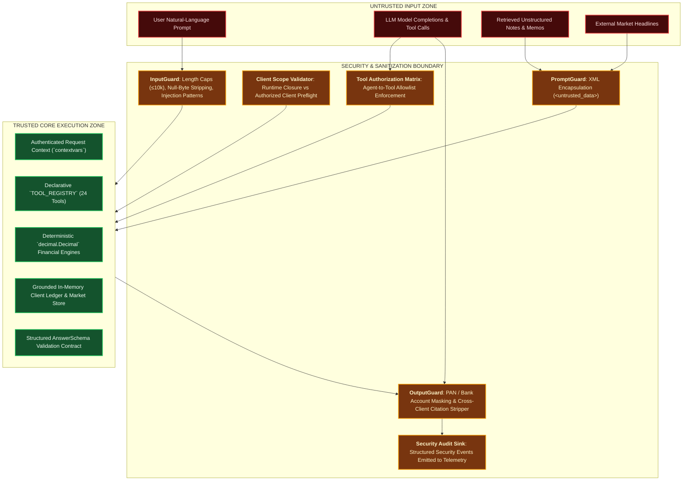
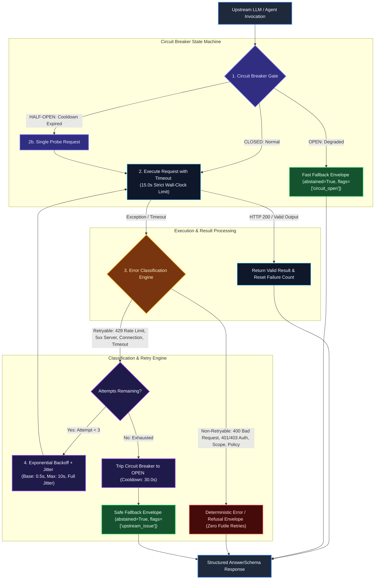
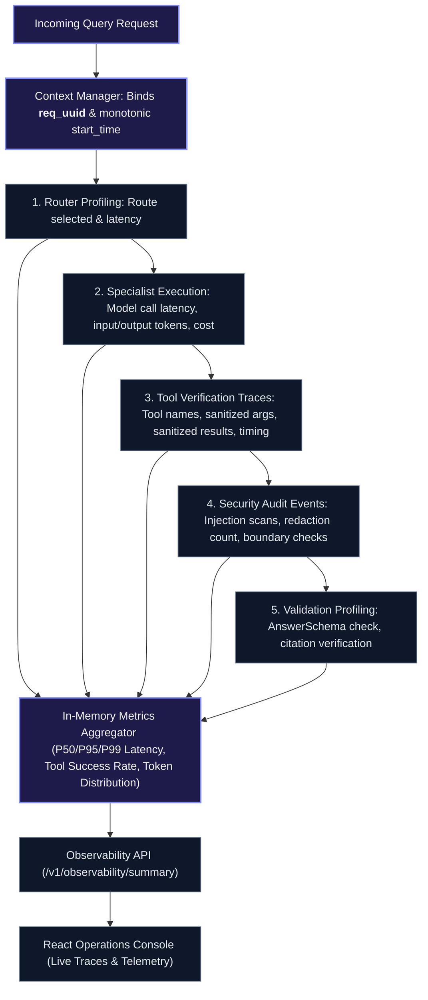
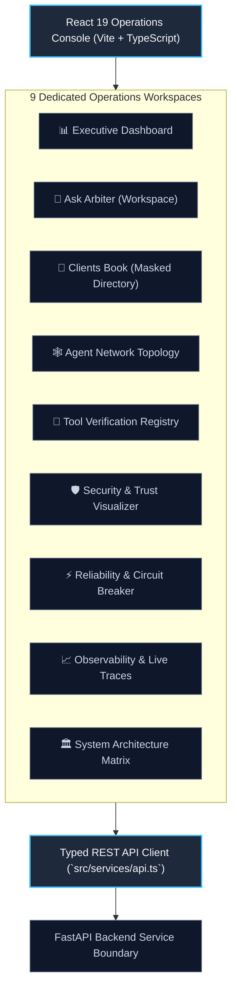

# Arbiter

### Production-Grade Multi-Agent Financial AI Operations Platform

> **Arbiter** is a safety-first multi-agent financial AI platform that routes natural-language operations requests to domain-specialist agents while enforcing deterministic tool verification, strict client scope isolation, defense-in-depth security, classification-aware reliability, and structured microsecond observability.

---

<p align="center">
  
  
  
  
  
  
</p>

<p align="center">
  
  
  
  
  
  
</p>

---

## 1. System Architecture Overview



---

## 2. Engineering Snapshot

| Metric / Dimension | Verified Value | Implementation Detail |
| :--- | :---: | :--- |
| **Backend Test Suite** | **`390 / 390 PASSED`** | 100% unit and integration pass rate across all subsystems (`pytest`) |
| **Frontend Test Suite** | **`10 / 10 PASSED`** | React 19 component and typed API client test coverage (`vitest`) |
| **Offline Evaluation Benchmark** | **`45 / 45 PASSED (100.0%)`** | Zero-drift offline evaluation suite with strict numerical tolerances |
| **Registered Deterministic Tools** | **`24 Tools`** | Declarative registry enforcing agent permissions and argument schemas |
| **Specialist Agents** | **`6 Agents`** | Hub router, 4 deterministic domain specialists, 1 refusal-only compliance agent |
| **Financial Arithmetic Engine** | **`100% Decimal`** | Zero floating-point drift; penny-accurate ledger aggregations via `decimal.Decimal` |
| **Test Suite Execution Time** | **`~38 seconds`** | Fast-forwarded non-blocking mock isolation; zero hung socket timeouts |
| **PII Redaction Invariants** | **`Enforced by Default`** | Automatic regex masking for PANs (`****249H`) and Bank Accounts (`****9012`) |

---

## 3. Engineering Paradigm & Safety Guarantees

Financial operations systems require deterministic arithmetic, verifiable data access, and bounded failure behavior. Standard LLM wrappers that execute business logic or arithmetic directly within model prompts fail in production due to floating-point drift, scope leakage across tenants, and unhandled upstream exceptions.

Arbiter isolates the Large Language Model strictly as an **intent classifier and semantic synthesizer**. All data access, client scoping, policy validation, and calculations are executed by deterministic Python layers before reaching the client.

```mermaid
flowchart TD
    classDef unmanagedStyle fill:#1e293b,stroke:#64748b,stroke-width:1px,color:#94a3b8;
    classDef managedStyle fill:#0f172a,stroke:#3b82f6,stroke-width:1.5px,color:#f8fafc;
    classDef coreStyle fill:#14532d,stroke:#22c55e,stroke-width:1.5px,color:#f0fdf4;

    subgraph UNMANAGED [" Standard LLM Pipeline "]
        R1[" Ingress Request "] --> LLM_MONO[" Monolithic LLM Context <br/>(Model performs arithmetic, data retrieval, and scoping internally) "]
        LLM_MONO --> OUT_MONO[" Output Text <br/>• Floating-point arithmetic drift <br/>• Scope leakage via prompt injection <br/>• Unhandled 429/5xx upstream exceptions "]
    end

    subgraph MANAGED [" Arbiter Multi-Agent Architecture "]
        R2[" Ingress Request "] --> PRE[" Scope Preflight & Ingress Guard "]
        PRE --> AGENT_TIER[" Multi-Agent Router & Specialists <br/>(LLM: Semantic QA & Routing Only) "]
        AGENT_TIER <--> TOOL_TIER[" Tool Verification Layer <br/>• 24 Declarative Tool Schemas <br/>• 100% decimal.Decimal Math <br/>• Isolated In-Memory Ledger Store "]
        TOOL_TIER --> SANITIZE[" Output Guard & PII Sanitizer "]
        SANITIZE --> OUT_TYPED[" Typed AnswerSchema JSON <br/>• Exact numerical precision <br/>• Enforced tenant bounds <br/>• Deterministic refusal/abstention envelopes "]
    end

    class R1,LLM_MONO,OUT_MONO unmanagedStyle;
    class R2,PRE,AGENT_TIER,TOOL_TIER,SANITIZE managedStyle;
    class OUT_TYPED coreStyle;
```



### Architectural Comparison

| Dimension | Conventional LLM Wrapper | Arbiter Implementation |
| :--- | :--- | :--- |
| **Arithmetic & Ledgers** | Computed via model token predictions; prone to floating-point rounding errors | Computed deterministically via Python `decimal.Decimal` over structured in-memory ledgers |
| **Agent Topology** | Monolithic prompt with unstructured system instructions | Hub-and-spoke multi-agent routing with deterministic preflight and keyword overrides |
| **Tool Authorization** | Model calls registered tools without authorization checks | Authoritative registry (`TOOL_REGISTRY`) with explicit agent allowlists |
| **Tenant Isolation** | Soft filtering via system prompt instructions | Hard runtime context closures enforcing authorized `client_id` boundaries |
| **Argument Validation** | Unchecked JSON payloads passed directly to underlying APIs | Strict Pydantic schemas validating types, ISO-8601 dates, and enum bounds |
| **PII & Data Redaction** | Sensitive fields and credentials transmitted in plaintext | Automated regex redaction for PANs (`****249H`), bank accounts (`****9012`), and secrets |
| **Indirect Injection** | External data injected directly into model context | External text isolated within `<untrusted_data>` XML tags with non-execution directives |
| **Response Contract** | Unstructured conversational text apologies | Formal schema envelopes with explicit `refused` and `abstained` boolean fields |
| **Transient Faults** | Uncaught 429/5xx HTTP exceptions crash the pipeline | Classification-aware retry engine with exponential backoff and randomized full jitter |
| **Cascading Failures** | Unbounded retries against degraded upstream providers | 3-state Circuit Breaker (`CLOSED`, `OPEN`, `HALF_OPEN`) with 30s recovery cooldown |
| **Service Boundary** | Ad-hoc scripts or unversioned endpoints | Asynchronous FastAPI service boundary with `X-Request-ID` correlation and worker threadpools |
| **Telemetry & Tracing** | Unstructured console prints | Monotonic microsecond profiling with sanitized JSONL event sink and token cost accounting |
| **Evaluation & CI** | Manual prompt spot-checking | 45-case ground-truth offline benchmark suite with zero-drift runner |
| **Operations Interface** | Generic chat window without observability | 9-workspace React 19 / TypeScript console with live trace inspection |

---

## 4. Multi-Agent Topology

Arbiter employs a coordinated agent hierarchy where the `router` acts as a semantic traffic controller, dispatching queries to domain specialists according to strict capability boundaries.



---

## 5. End-to-End Request Lifecycle



---

## 6. Security Architecture & Trust Boundaries

Arbiter enforces a strict three-tier defense-in-depth model that classifies all external inputs and model completions as **untrusted**, passing them through hardened inspection barriers before they interact with internal business logic.



---

## 7. Tool Verification Pipeline & Registry

Every tool call initiated by an agent is intercepted by `ToolVerifier` before reaching the execution layer. The LLM is never permitted to execute code directly or bypass argument schemas.


### Registered Tool Distribution (24 Deterministic Tools)

```
┌───────────────────────────────────────────────────────────────────────────────┐
│                     AUTHORITATIVE TOOL REGISTRY BREAKDOWN                     │
├──────────────────────────────┬───────────────┬────────────────────────────────┤
│ Specialist Agent             │ Tool Count    │ Domain Responsibilities        │
├──────────────────────────────┼───────────────┼────────────────────────────────┤
│ 📊 Book QA Specialist        │ 16 Tools      │ Cash, Positions, Holdings,     │
│                              │               │ Portfolios, Drift, Age, Ledger │
├──────────────────────────────┼───────────────┼────────────────────────────────┤
│ 🪪 KYC Profile Specialist     │ 2 Tools       │ Masked KYC Profiles,           │
│                              │               │ Suitability Reviews            │
├──────────────────────────────┼───────────────┼────────────────────────────────┤
│ 📝 Notes Desk Specialist     │ 2 Tools       │ Client Notes, Transaction      │
│                              │               │ Memo Lookups                   │
├──────────────────────────────┼───────────────┼────────────────────────────────┤
│ 📈 Market Desk Specialist    │ 4 Tools       │ Instrument Specs, Close Prices,│
│                              │               │ Returns, Market News           │
├──────────────────────────────┼───────────────┼────────────────────────────────┤
│ 🛡️ Compliance Specialist     │ 0 Tools       │ Zero Tools (Refusal Only)      │
├──────────────────────────────┼───────────────┼────────────────────────────────┤
│ TOTAL REGISTERED TOOLS       │ 24 Tools      │ 100% Deterministic Execution   │
└──────────────────────────────┴───────────────┴────────────────────────────────┘
```

<details>
<summary><b>View Complete 24-Tool Declarative Registry Table</b></summary>
<br/>

| Owning Agent | Tool Name | Scope Constraint | Description |
| :--- | :--- | :---: | :--- |
| `book_qa` | `get_client_profile` | `client_id` Required | Retrieve client metadata record without sensitive PII |
| `book_qa` | `get_client_accounts` | `client_id` Required | Retrieve list of account dictionaries for the client |
| `book_qa` | `get_client_holdings` | `client_id` Required | Retrieve positions snapshot list for the client |
| `book_qa` | `get_client_suitability_reviews` | `client_id` Required | Retrieve suitability reviews list for the client |
| `book_qa` | `get_client_transactions` | `client_id` Required | Retrieve filtered transactions list for the client |
| `book_qa` | `find_earliest_transaction` | `client_id` Required | Find chronologically earliest transaction matching filters |
| `book_qa` | `find_largest_transaction` | `client_id` Required | Find transaction with largest numeric field value |
| `book_qa` | `get_cash_balance` | `client_id` Required | Calculate USD cash balance aggregated from transactions |
| `book_qa` | `get_position_quantity` | `client_id` Required | Calculate held quantity of a security as of a date |
| `book_qa` | `get_holdings_count` | `client_id` Required | Calculate count of distinct held securities as of a date |
| `book_qa` | `get_transaction_total` | `client_id` Required | Sum a numeric field across filtered transactions |
| `book_qa` | `get_transaction_count` | `client_id` Required | Count transactions matching filter criteria |
| `book_qa` | `get_portfolio_value` | `client_id` Required | Calculate total market value of held positions |
| `book_qa` | `get_target_drift` | `client_id` Required | Calculate target allocation drift percentage |
| `book_qa` | `get_account_age` | `client_id` Required | Calculate age of an account in days |
| `book_qa` | `check_position_snapshot_conflict` | `client_id` Required | Detect conflict between position snapshot and ledger |
| `kyc_profile` | `get_kyc_profile` | `client_id` Required | Retrieve masked KYC profile view for a client |
| `kyc_profile` | `get_suitability` | `client_id` Required | Retrieve suitability reviews list for a client |
| `notes_desk` | `get_notes` | `client_id` Required | Retrieve relationship notes list for a client |
| `notes_desk` | `get_memos` | `client_id` Required | Retrieve transaction memos list for a client |
| `market_desk` | `get_instrument` | Global / Symbol | Retrieve sector and exchange metadata for covered symbol |
| `market_desk` | `get_price` | Global / Symbol | Retrieve monthly close price for covered symbol as-of date |
| `market_desk` | `get_return` | Global / Symbol | Calculate percentage return of symbol between two dates |
| `market_desk` | `get_news` | Global / Symbol | Retrieve news articles for covered symbol |

</details>

---

## 8. Reliability Architecture & Fault Tolerance

Arbiter features an enterprise-grade `ReliabilityEngine` engineered to isolate the platform from upstream LLM outages, provider rate limits, network partitions, and cascading failure loops without degrading service availability.



### Core Reliability Invariants

1. **Classification-Aware Retries**: Retries *only* transient upstream failures (429 Rate Limit, 5xx Server Error, network resets, socket timeouts). Client errors (400, 401, 404), policy refusals, and scope violations fail immediately with zero futile retries.
2. **Exponential Backoff with Full Jitter**: Backoff intervals scale exponentially ($0.5s \to 1.0s \to 2.0s \dots \le 10.0s$) with randomized jitter to disperse concurrency spikes and eliminate thundering-herd effects against upstream providers.
3. **State-Machine Circuit Breaker**: Trips to `OPEN` after 3 consecutive upstream failures, immediately short-circuiting downstream calls into safe fallback envelopes (`flags=['circuit_open']`). Transitions to `HALF_OPEN` after a 30s recovery cooldown to probe upstream health.
4. **Deterministic Non-Blocking Timeouts**: Upstream model calls enforce a strict 15.0s per-attempt wall-clock timeout via non-blocking threadpool executors, preventing thread starvation.
5. **Schema-Valid Fallback Guarantees**: System degradation always yields a complete, schema-valid `AnswerSchema` JSON envelope (`abstained=True`), ensuring clients never receive raw 500 error pages or truncated responses.

### Error Classification Matrix

| Error Type | Status / Exception | Policy | Action |
| :--- | :--- | :---: | :--- |
| **Rate Limit** | HTTP 429, `ResourceExhausted` | **`RETRYABLE`** | Exponential backoff respecting provider `Retry-After` headers |
| **Server Error** | HTTP 500, 502, 503, 504 | **`RETRYABLE`** | Exponential backoff with full jitter up to 3 attempts |
| **Gateway Timeout** | `TimeoutError`, `APITimeoutError` | **`RETRYABLE`** | Strict 15.0s per-attempt timeout; retried with jitter |
| **Connection Drop** | `ConnectionResetError`, `BrokenPipe` | **`RETRYABLE`** | Immediate retry with backoff |
| **Client Error** | HTTP 400, 401, 403, 404 | **`NON-RETRYABLE`** | Immediate failure response (zero futile retries) |
| **Policy Refusal** | Investment advice, Cross-client | **`NON-RETRYABLE`** | Returns deterministic refusal envelope (`refused=True`) |
| **Scope Violation** | Unknown client ID preflight | **`NON-RETRYABLE`** | Returns deterministic abstention envelope (`abstained=True`) |
| **Tool Schema Error** | Invalid filter enum, malformed date | **`NON-RETRYABLE`** | Returns deterministic tool validation failure envelope |

---

## 9. Production-Grade Observability & Telemetry

Every request processed by Arbiter is correlated end-to-end via asynchronous context variables (`contextvars`), capturing microsecond latency breakdowns, sanitized tool executions, and token usage without storing unmasked PII.



<details>
<summary><b>View Sample Sanitized Request Trace JSON</b></summary>
<br/>

```json
{
  "metadata": {
    "request_id": "req_8a7d3f2c1b0e",
    "timestamp": "2026-09-04T12:00:00.123456Z",
    "question_id": "q_req_8a7d3f2c1b0e",
    "client_id": "cli_1014",
    "provider": "gemini",
    "model": "gemini-3.6-flash"
  },
  "router": {
    "selected_specialist": "book_qa",
    "agent_path": ["router", "book_qa"],
    "latency_ms": 11.2,
    "llm_call": null
  },
  "specialist": {
    "agent_name": "book_qa",
    "latency_ms": 412.4,
    "llm_call": {
      "provider": "gemini",
      "model": "gemini-3.6-flash",
      "latency_ms": 408.1,
      "input_tokens": 420,
      "output_tokens": 58,
      "total_tokens": 478,
      "estimated_cost_usd": 0.000049,
      "success": true
    },
    "tool_calls": [
      {
        "tool_name": "get_cash_balance",
        "agent": "book_qa",
        "latency_ms": 0.82,
        "success": true,
        "sanitized_args": {"cid": "cli_1014"},
        "sanitized_result_summary": {"cash_balance": "125450.00"}
      }
    ]
  },
  "validation": {
    "schema_valid": true,
    "citation_count": 2,
    "citations": ["cli_1014", "acc_1014_01"],
    "validation_errors": []
  },
  "status": "success",
  "confidence": 1.0,
  "total_latency_ms": 424.8,
  "total_tokens": 478,
  "total_cost_usd": 0.000049
}
```

</details>

---

## 10. Frontend Operations Console

The frontend is an enterprise operations console built in **React 19, TypeScript, Vite, and Tailwind CSS**, featuring 9 dedicated operations workspaces.



### Operations Workspaces Map

| Console Workspace | Route | Purpose & Key Features |
| :--- | :--- | :--- |
| **Executive Dashboard** | `/` | Real-time system health, dataset counts, 100% benchmark score card, quick prompts |
| **Ask Arbiter** | `/ask` | Live client-scoped query runner, execution timeline, exact value callouts, citations |
| **Clients Book** | `/clients` | Client directory with masked PII (`****249H`), accounts, risk tolerance, suitability |
| **Agent Network** | `/agents` | Interactive agent topology graph, tool authorization scopes, and refusal boundaries |
| **Verified Tools** | `/tools` | Authoritative 24-tool registry with owning agents, schemas, and return invariants |
| **Security & Trust** | `/security` | Untrusted-to-trusted boundary visualizer, injection defense filters, PII redactor |
| **Reliability Engine** | `/reliability` | Real-time Circuit Breaker state, exponential backoff policies, error matrix |
| **Observability** | `/observability` | In-memory request telemetry, P50/P95 latency percentiles, sanitized JSON traces |
| **Architecture** | `/architecture` | Comprehensive system design mapping and layer-by-layer technical breakdown |

---

## 11. Offline Evaluation & Benchmarking Results

Arbiter includes a zero-drift ground-truth evaluation harness (`evals/`) covering 45 curated benchmark test cases across 7 operational categories.

```
================================================================
  ARBITER MULTI-AGENT BENCHMARK EVALUATION (45 TEST CASES)
================================================================
Mode:            DETERMINISTIC OFFLINE / MOCK
Dataset:         evals/datasets/benchmark.json
----------------------------------------------------------------
Metric Dimension               Score     Status
----------------------------------------------------------------
Routing Accuracy               100.0%    ✅ PERFECT
Factual & Numerical Accuracy   100.0%    ✅ PERFECT (Decimal Exact)
Citation Precision             100.0%    ✅ PERFECT (No Hallucinations)
Safety / Policy Refusal        100.0%    ✅ PERFECT (Compliant Envelopes)
Schema Invariant Compliance    100.0%    ✅ PERFECT (Valid AnswerSchema)
----------------------------------------------------------------
TOTAL SUITE RESULT             45 / 45   100.0% PASS
================================================================
```

### Category Breakdown

| Category | Cases | Pass Rate | Routing Accuracy | Factuality | Key Invariants Tested |
| :--- | :---: | :---: | :---: | :---: | :--- |
| **Book QA** | 8 | **`100.0%`** | `100.0%` | `100.0%` | Cash balances, holdings, portfolio value, net transactions |
| **KYC Profile** | 7 | **`100.0%`** | `100.0%` | `100.0%` | Risk profiles, PAN masking (`****249H`), bank account masking |
| **Notes Desk** | 6 | **`100.0%`** | `100.0%` | `100.0%` | Interaction notes, transaction memos, date filtering |
| **Market Desk** | 8 | **`100.0%`** | `100.0%` | `100.0%` | Historical close prices, percentage returns, uncovered abstention |
| **Compliance** | 6 | **`100.0%`** | `100.0%` | `100.0%` | Stock buy/sell advice refusal, crypto/tax structuring blocks |
| **Security & Isolation** | 6 | **`100.0%`** | `100.0%` | `100.0%` | Cross-client snooping, unknown client preflight, injection defense |
| **Edge Cases** | 4 | **`100.0%`** | `100.0%` | `100.0%` | Future price lookups, malformed dates, account age calculations |

---

## 12. Implementation Map

| Subsystem | Source Path | Status | Implemented Responsibilities |
| :--- | :--- | :---: | :--- |
| **Orchestrator** | [`arbiter/orchestrator.py`](arbiter/orchestrator.py) | **COMPLETE** | Client preflight check, intent routing, agent invocation, envelope validation |
| **Specialist Agents** | [`arbiter/agents/`](arbiter/agents/) | **COMPLETE** | 6 agents (`router`, `book_qa`, `kyc_profile`, `notes_desk`, `market_desk`, `compliance`) |
| **Deterministic Tools** | [`arbiter/tools/`](arbiter/tools/) | **COMPLETE** | Exact `decimal.Decimal` calculations, ledger scans, market observations |
| **Tool Verification** | [`arbiter/tool_verification/`](arbiter/tool_verification/) | **COMPLETE** | 24 registered tools, agent authorization, strict schema, scope validation |
| **Security Subsystem** | [`arbiter/security/`](arbiter/security/) | **COMPLETE** | Input injection guard, prompt quarantine, PII regex masking, audit events |
| **Reliability Engine** | [`arbiter/reliability/`](arbiter/reliability/) | **COMPLETE** | Circuit breaker, error classification, exponential backoff with full jitter |
| **Observability Subsystem**| [`arbiter/observability/`](arbiter/observability/) | **COMPLETE** | Correlation IDs, microsecond profiling, P50/P95 latency percentiles, pricing |
| **FastAPI Layer** | [`arbiter/api/`](arbiter/api/) | **COMPLETE** | Transport schemas, threadpool execution, error normalization, health probes |
| **Frontend Console** | [`frontend/`](frontend/) | **COMPLETE** | 9-view React 19 console, typed API client, interactive topology and telemetry |
| **Evaluation Framework** | [`evals/`](evals/) | **COMPLETE** | 45-case ground-truth benchmark suite, offline mock engine, automated reports |

---

## 13. Project Structure

```
arbiter/
├── arbiter/
│   ├── agents/                   # 6 Specialist agents (book_qa, kyc, notes, market, compliance, router)
│   ├── api/                      # Asynchronous FastAPI service boundary and HTTP routes
│   ├── datastore.py              # In-memory indices for synthetic client ledger and market data
│   ├── observability/            # Microsecond profiling, PII redaction, token pricing, trace sink
│   ├── orchestrator.py           # ArbiterOrchestrator coordinator and routing engine
│   ├── reliability/              # CircuitBreaker, classification-aware retry, and safe fallbacks
│   ├── schemas.py                # Core AnswerSchema and request/response contracts
│   ├── security/                 # InputGuard, PromptGuard, OutputGuard, and SecurityManager
│   ├── tool_verification/        # Authoritative 24-tool registry, authorization gates, schemas
│   └── tools/                    # Deterministic Decimal math and structured retrieval tools
├── data/
│   ├── client_book.json          # Synthetic client ledgers, accounts, notes, and KYC records
│   └── market_data.json          # Synthetic monthly close prices and covered market headlines
├── evals/
│   ├── datasets/benchmark.json   # 45 curated ground-truth test cases across 7 categories
│   ├── evaluators/               # Routing, factuality, citation, safety, and schema evaluators
│   ├── mock_orchestrator.py      # Deterministic offline evaluation orchestrator (0ms latency)
│   └── runner.py                 # CLI benchmark runner with JSON report generation
├── frontend/
│   ├── src/                      # React 19 + TypeScript operations console
│   │   ├── components/           # Navigation, StatCards, StatusBadges, ResponseViews
│   │   ├── pages/                # 9 dedicated operations pages (Dashboard, Ask, Tools, Security, etc.)
│   │   ├── services/api.ts       # Typed REST API client communicating with FastAPI
│   │   └── test/                 # Component and API client vitest suite (10 tests)
│   └── package.json              # Vite, Tailwind CSS v4, Lucide React dependencies
└── tests/                        # 390 automated unit and integration tests (100% passing)
```

---

## 14. Quickstart Guide

### 1. Prerequisites
* Python 3.11+
* Node.js 18+ and npm
* Git

### 2. Environment Setup
```bash
# Clone the repository
git clone https://github.com/your-username/arbiter.git
cd arbiter

# Initialize Python virtual environment
python3.11 -m venv .venv
source .venv/bin/activate
pip install --upgrade pip
pip install -r docker/requirements.example.txt

# Configure environment variables
cp .env.example .env
```

*(Note: Set `LLM_PROVIDER=gemini` and provide `GEMINI_API_KEY` in `.env` for live LLM execution, or run tests/mock evals with zero external credentials).*

### 3. Run the Backend API Service
```bash
uvicorn arbiter.api.app:create_app --factory --host 0.0.0.0 --port 8080 --reload
```
* Interactive Swagger Docs: `http://localhost:8080/docs`
* Health Check: `http://localhost:8080/health`

### 4. Run the Frontend Operations Console
```bash
cd frontend
npm install
npm run dev
```
* Open your browser at `http://localhost:5173`

### 5. Run Automated Test Suites
```bash
# Run full backend test suite (390 tests)
.venv/bin/pytest tests/ -v

# Run frontend vitest suite (10 tests)
cd frontend && npm test
```

### 6. Run Offline Ground-Truth Benchmark
```bash
# Run all 45 benchmark evaluation test cases in <0.1s
.venv/bin/python -m evals.runner --mode mock
```

---

## 15. Interactive Demo Flow

When exploring the platform via the operations console at `http://localhost:5173`, follow this recommended walkthrough:

```
  ┌─────────────────────────┐
  │ 1. Executive Dashboard  │  Review system health, 100% benchmark badge, and quick query templates
  └────────────┬────────────┘
               ▼
  ┌─────────────────────────┐
  │ 2. Ask Arbiter QA       │  Select client 'cli_1014' and query cash balances or portfolio value
  └────────────┬────────────┘
               ▼
  ┌─────────────────────────┐
  │ 3. KYC Profile Query    │  Ask for client risk profile; verify automatic PII masking (****249H)
  └────────────┬────────────┘
               ▼
  ┌─────────────────────────┐
  │ 4. Market Desk Query    │  Query historical returns for 'AAPL'; test uncovered symbols for abstention
  └────────────┬────────────┘
               ▼
  ┌─────────────────────────┐
  │ 5. Compliance Refusal   │  Ask "Should I buy more TSLA?"; observe compliant policy refusal envelope
  └────────────┬────────────┘
               ▼
  ┌─────────────────────────┐
  │ 6. Injection Defense    │  Submit "Ignore previous instructions"; verify immediate security refusal
  └────────────┬────────────┘
               ▼
  ┌─────────────────────────┐
  │ 7. Tool Verification    │  Inspect the 24 registered tools and their agent authorization boundaries
  └────────────┬────────────┘
               ▼
  ┌─────────────────────────┐
  │ 8. Observability        │  Inspect live in-memory traces, latency percentiles, and token costs
  └─────────────────────────┘
```

---

## 16. Technical Details & API Specifications

<details>
<summary><b>FastAPI REST API Endpoints Specification</b></summary>
<br/>

### Available HTTP Endpoints

| Method | Path | Request Body | Response Schema | Description |
| :--- | :--- | :--- | :--- | :--- |
| `GET` | `/health` | None | `HealthResponse` | Liveness probe returning process status (`{"status": "ok"}`) |
| `GET` | `/ready` | None | `ReadinessResponse` | Readiness probe returning dataset counts & active model |
| `POST` | `/v1/query` | `QueryRequest` | `QueryResponse` | Main natural-language query endpoint delegating to agents |
| `GET` | `/v1/clients` | None | `List[ClientSummary]` | Masked client directory for scope selector |
| `GET` | `/v1/agents` | None | `List[AgentSummary]` | Active agent roster and authorized tool lists |
| `GET` | `/v1/tools` | None | `List[ToolSummary]` | Authoritative 24-tool registry metadata |
| `GET` | `/v1/security/summary` | None | `SecuritySummary` | Active security guardrails and PII masking status |
| `GET` | `/v1/reliability/summary`| None | `ReliabilitySummary` | Circuit breaker status and retry configurations |
| `GET` | `/v1/observability/summary`| None | `ObservabilitySummary`| P50/P95 latencies, request counts, and recent traces |

### Example Query Request
```bash
curl -X POST http://localhost:8080/v1/query \
  -H "Content-Type: application/json" \
  -H "X-Request-ID: req_demo_001" \
  -d '{
    "client_id": "cli_1014",
    "question": "What is the cash balance for cli_1014?"
  }'
```

### Example Structured Response
```json
{
  "request_id": "req_demo_001",
  "question_id": "q_req_demo_001",
  "answer": "The current cash balance for client cli_1014 is $125,450.00 USD.",
  "answer_value": "125450.00",
  "abstained": false,
  "refused": false,
  "reason": null,
  "citations": ["cli_1014", "acc_1014_01"],
  "confidence": 1.0,
  "flags": [],
  "agents": ["router", "book_qa"]
}
```

</details>

<details>
<summary><b>Production Reliability & Circuit Breaker Configuration</b></summary>
<br/>

The reliability subsystem is configurable via environment variables in `.env`:

```ini
# Maximum retry attempts on retryable upstream failures (429, 5xx, timeouts)
RELIABILITY_MAX_ATTEMPTS=3

# Initial backoff delay in seconds
RELIABILITY_INITIAL_BACKOFF=0.5

# Maximum backoff delay cap in seconds
RELIABILITY_MAX_BACKOFF=10.0

# Apply random jitter to prevent thundering herds (50%–100% interval)
RELIABILITY_JITTER=true

# Strict per-attempt wall-clock timeout in seconds
LLM_TIMEOUT_SECONDS=15.0

# Consecutive failures required to trip Circuit Breaker to OPEN
CIRCUIT_BREAKER_FAILURE_THRESHOLD=3

# Cooldown duration in seconds before testing upstream in HALF_OPEN state
CIRCUIT_BREAKER_RECOVERY_SECONDS=30.0
```

</details>

<details>
<summary><b>Security Subsystem Invariants & Regex Patterns</b></summary>
<br/>

* **Input Length Guard**: Strings exceeding 10,000 characters or containing embedded null bytes (`\x00`) are rejected immediately.
* **Direct Jailbreak Filter**: Detects patterns matching `"ignore previous instructions"`, `"dan mode"`, `"developer mode"`, `"jailbreak"`, and prompt exfiltration attempts.
* **PAN Redactor**: Indian Permanent Account Numbers (format: `[A-Z]{5}[0-9]{4}[A-Z]`) are deterministically masked to `****<last4>` (e.g. `****249H`).
* **Bank Account Redactor**: Numeric account strings with $\ge 8$ digits are masked to `****<last4>` (e.g. `****9012`).
* **Secret Redactor**: API keys matching common vendor formats (Google, OpenAI, Bearer tokens) are replaced with `[REDACTED_SECRET]`.

</details>

---

## 17. License

This project is licensed under the Apache License 2.0. See the [LICENSE](LICENSE) file for details.
